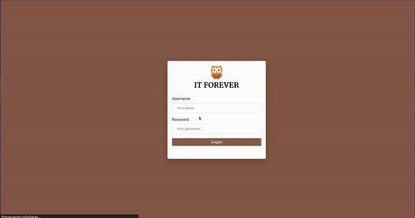
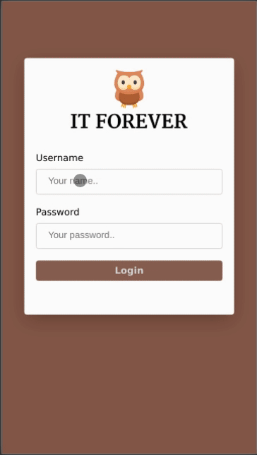

# IT-Forever

## <a href="https://itforever.netlify.app/">Veja o projeto em ação</a>

## Linguagens e ferramentas utilizadas

* ReactJs
* TypeScript
* Styled Components

## Para inicializar o projeto na sua máquina local.

### API - Banco MySQL
<b>1º Vá para o repositório onde está localizado o código da api do projeto "<a href="https://github.com/GuScarpim/IT-Forever-Back">https://github.com/GuScarpim/IT-Forever-Back</a>".</b>

<b>2º Vá para a pasta <a href="https://github.com/GuScarpim/IT-Forever-Back/blob/main/src/Database/db.js">src/src/Database/db.js</a> e coloque as configurações do seu banco de dados.</b>

<b>3º Na pasta <a href="https://github.com/GuScarpim/IT-Forever-Back/blob/main/src/Database/db.sql">/src/Database/db.sql</a> rode os comandos que estão dentro do db.sql no seu banco MySql.</a>

<b>4º Rode o backend com yarn dev.</b>

### Frontend

<b>1º Clone esse repositório no seu computador ou baixe no formato (ZIP).</b>

<b>2º Abra o seu terminal e na raiz do projeto rode o comando `npm install` ou `yarn` para baixar todas as depêndencias do projeto.</b>

<b>3º Dentro da pasta <a href="https://github.com/GuScarpim/IT-Forever/blob/main/src/Globals.json">src/Globals.json</a> troque o caminho da sua api para o seu endpoint local.</b>

<b>4º Rode o comando `npm start` ou `yarn start`.</b>

<b>5º Entre na aplicação com o nome de usuário e senha que você cadastrou no seu banco.</b>

# Desenvolvido por Gustavo Scarpim:

## Desktop

## Mobile

